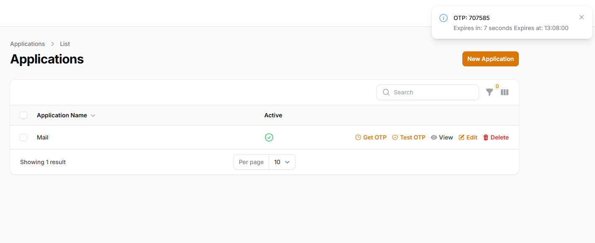

# Authenticator app

🚀 **Get your Laravel application running in under 2 minutes!**



A complete, ready-to-use Docker setup for Laravel development with PHP 8.2, MySQL 8.0, and Nginx. No complex configuration needed!

## 🎯 What You Get

- ✅ **PHP 8.2** with all Laravel extensions
- ✅ **MySQL 8.0** database (pre-configured)
- ✅ **Nginx** web server
- ✅ **Laravel** latest version
- ✅ **Hot reload** for instant development
- ✅ **One-command setup**

## 🛠️ Prerequisites

You only need:
- [Docker Desktop](https://www.docker.com/products/docker-desktop/) installed and running

That's it! No need to install PHP, MySQL, or Nginx separately.

## ⚡ Quick Start (2 minutes)

### Step 1: Start Everything
```bash
# Clone and start (or just start if already cloned)
docker compose up -d
```

### Step 2: Install Dependencies
```bash
# Install Laravel dependencies
docker compose run --rm composer install
```

### Step 3: Set Up Database
```bash
# Run database migrations
docker compose run --rm artisan migrate
```

### Step 4: Open Your App
🎉 **Your app is ready!** Open: http://localhost:8000

## 🔧 Daily Development Commands

### Laravel/Artisan Commands
```bash
# Create new controller
docker compose run --rm artisan make:controller YourController

# Create new model
docker compose run --rm artisan make:model YourModel

# Run migrations
docker compose run --rm artisan migrate

# Seed database
docker compose run --rm artisan db:seed

# Clear cache
docker compose run --rm artisan cache:clear

# Run tests
docker compose run --rm artisan test

# Access Laravel Tinker
docker compose run --rm artisan tinker
```

### Composer Package Management
```bash
# Install new packages
docker compose run --rm composer require vendor/package-name

# Update all packages
docker compose run --rm composer update

# Install from composer.json
docker compose run --rm composer install
```

### Docker Management
```bash
# Start services
docker compose up -d

# Stop services
docker compose down

# Restart services
docker compose restart

# View logs
docker compose logs -f

# Check service status
docker compose ps
```

## 🗄️ Database Access

**From your application:** Already configured! Laravel will connect automatically.

**Direct access:**
```bash
# Connect to MySQL shell
docker compose exec mysql mysql -u laravel -p laravel
# Password: laravel
```

**External tools (phpMyAdmin, etc.):**
- Host: `localhost`
- Port: `3306`
- Database: `laravel`
- Username: `laravel`
- Password: `laravel`

## 🔍 Container Details

| Service | Container | Purpose | Port |
|---------|-----------|---------|------|
| **app** | laravel_app | PHP 8.2 Application | - |
| **nginx** | laravel_nginx | Web Server | 8000 |
| **mysql** | laravel_mysql | Database | 3306 |
| **composer** | laravel_composer | Package Manager | - |
| **artisan** | laravel_artisan | Laravel CLI | - |

## 🚀 Advanced Usage

### Access Container Shell
```bash
# Access app container for debugging
docker compose exec app bash

# Access database container
docker compose exec mysql bash
```

### Environment Configuration
Edit `.env` file in your project root to customize:
- Database credentials
- Application settings
- Debug modes

### Custom PHP Configuration
Modify `docker/php/php.ini` for custom PHP settings.

## 🆘 Troubleshooting

### Port 8000 Already in Use?
```bash
# Stop the conflicting service or use different port
docker compose down
# Edit docker-compose.yml to change port from 8000 to 8080
```

### Permission Issues?
```bash
# Fix Laravel storage permissions
docker compose exec app chown -R www-data:www-data storage bootstrap/cache
docker compose exec app chmod -R 775 storage bootstrap/cache
```

### Can't Connect to Database?
```bash
# Restart MySQL container
docker compose restart mysql

# Check if MySQL is running
docker compose exec mysql mysql -u laravel -p laravel -e "SELECT 1"
```

### Fresh Start?
```bash
# Complete reset (⚠️ This will delete your database!)
docker compose down -v
docker compose up -d
docker compose run --rm composer install
docker compose run --rm artisan migrate
```

## 🎓 New to Laravel?

After setup, try these commands to explore:

```bash
# Create your first route
docker compose run --rm artisan make:controller WelcomeController

# Create a model with migration
docker compose run --rm artisan make:model Post -m

# View all available artisan commands
docker compose run --rm artisan list
```

## 📱 Access Points

- **🌐 Application**: http://localhost:8000
- **🗃️ Database**: localhost:3306
- **📊 Logs**: `docker compose logs -f`

## 📄 License

This project is licensed under the MIT License - see the [LICENSE](LICENSE) file for details.

---

**Happy coding! 🎉** Your Laravel development environment is ready for action!
